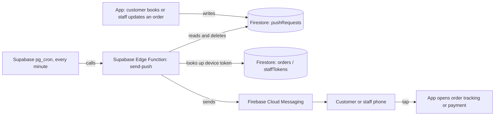

# Royal Luxury Laundry Mobile App

Android and iOS app for **Royal Luxury Laundry**, a pickup and delivery laundry service in Kumasi, Ghana. Customers book a pickup, follow their order, and pay online. Staff use the same app to run the order dashboard.

The business already had a working website. This project turns it into native store apps and replaces the website's email notifications with **push notifications** to the customer's or staff member's phone.

## What the app does

- **Book a pickup:** choose a service, express option, address (with a map pin), date and time
- **Track an order:** see the order's status timeline (Requested, Accepted, Picked Up, Washing, Ready for Delivery, Delivered)
- **Pay online:** pay through Paystack once the order is priced and ready
- **Push notifications** for booking confirmation, status changes, "ready for delivery" with the final price, "on the way", and payment received
- **Live delivery ETA:** while staff share their location, the tracking page shows a live map and arrival estimate, and the customer gets one notification that refreshes every minute ("about 9 min away"), then "Arriving now"
- **Tap to act:** tapping a notification opens that order's tracking page, and a "ready for delivery" notification goes straight to payment
- **Staff dashboard:** staff sign in with their own accounts, manage orders, set prices and get a push for every new booking
- **Referral rewards** and loyalty points

## Tech stack

| Layer | Technology |
| --- | --- |
| App shell | Capacitor 6 (native Android and iOS around one web codebase) |
| Front end | HTML, CSS, JavaScript (single page app), Leaflet maps |
| Database | Firebase Cloud Firestore, with security rules in [`firestore.rules`](firestore.rules) |
| Auth | Firebase Authentication (staff email and password accounts) |
| Push delivery | Firebase Cloud Messaging (FCM) |
| Push worker | Supabase Edge Function written in TypeScript on Deno, run every minute by `pg_cron` |
| Payments | Paystack |
| Builds | Android Studio and Gradle (Android), Xcode (iOS) |

## How push notifications work

The website sent emails through EmailJS. In the app, the same `sendEmailJS()` call writes a small request into Firestore instead, and a serverless worker turns it into a push.



Why it is built this way:

- **No paid Firebase plan.** Firebase Cloud Functions need the paid Blaze plan, so the worker runs on Supabase's free tier instead. Firestore stays the one database shared by the website and the app.
- **The live website is untouched.** The website keeps sending emails. Only the app's copy of the code sends pushes.
- **Locked down writes.** Security rules let the public create a push request only in a fixed shape, and nobody can read them from the client. Customers can attach a device token to their own order and change nothing else.
- **Protected worker.** The worker only runs when the caller sends a secret token, so a stranger who finds its URL cannot trigger it.
- **Deno compatibility fix.** Firestore's default gRPC connection fails on Deno (`14 UNAVAILABLE`), so the worker switches the Admin SDK to REST (`preferRest: true`).

## Project structure

```
www/                          The app itself
  index.html                  Page structure: booking form, tracking, payment, staff dashboard
  js/app.js                   App logic: Firestore reads and writes, Paystack checkout, staff auth,
                              push registration and notification tap handling
  css/styles.css              Styling
  images/                     Logo and icons
  cap/                        Capacitor runtime and push notification plugin
supabase/functions/send-push/ Push worker (TypeScript, Deno)
firestore.rules               Firestore security rules shared by the website and the app
firebase.json, .firebaserc    Firebase CLI config for deploying the rules
capacitor.config.json         App id, name, push and splash screen settings
android/                      Native Android project (open in Android Studio)
ios/                          Native iOS project (open in Xcode)
assets/                       Source icon and splash images
SUPABASE_SETUP.md             How to deploy the push worker and the cron job
MOBILE_APP_HANDOFF.md         Full build and store release guide
```

## Running it yourself

1. Install Node.js, then run `npm install`
2. Create a Firebase project, register an Android and an iOS app, and put the downloaded `google-services.json` in `android/app/` and `GoogleService-Info.plist` in `ios/App/App/` (both are gitignored)
3. Put your own Firebase web config and Paystack public key in `www/js/app.js`
4. Deploy the rules with `firebase deploy --only firestore:rules`
5. Deploy the push worker by following [`SUPABASE_SETUP.md`](SUPABASE_SETUP.md)
6. Run `npx cap sync`, then `npx cap open android` or `npx cap open ios` and press Run

> Run `npx cap sync android` after every change to `www/`, because Android Studio's Run button does not copy updated web files on its own.

## Not included in this repo

These are kept out on purpose:

- The Android signing key and its passwords
- The Firebase service account key and the push worker secret (stored as Supabase secrets)
- `google-services.json` and `GoogleService-Info.plist`
- The real offline admin passcode (`ADMIN_PASSCODE` in `www/js/app.js` is set to `CHANGE_ME`)

The Firebase web config and the Paystack public key that remain in `www/js/app.js` are designed to be public. The Firestore rules above keep the data safe.
